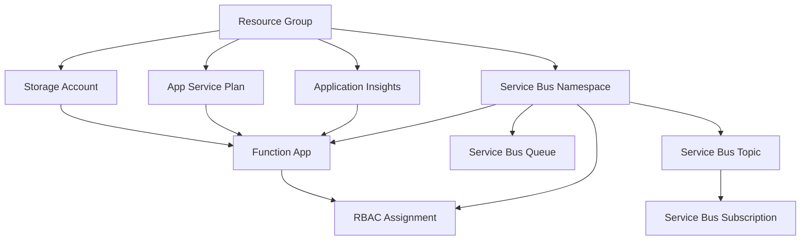

# Terraform struktura - Přehled komponent

Terraform konfigurace je rozdělena do logických celků pro lepší organizaci a údržbu.

## 📁 Struktura souborů

```
Terraform/
├── main.tf                 # Provider konfigurace a data sources
├── variables.tf            # Definice všech proměnných
├── outputs.tf             # Výstupní hodnoty
├── terraform.tfvars.example # Ukázková konfigurace
├── 
├── # === Komponenty služeb ===
├── resource-group.tf      # Resource Group
├── storage.tf             # Storage Account pro Functions
├── functions.tf           # App Service Plan + Function App
├── servicebus.tf          # Service Bus Namespace, Queue, Topic
├── monitoring.tf          # Application Insights
├── iam.tf                 # RBAC role assignments
├── 
├── # === Dokumentace a deployment ===
├── README.md              # Hlavní dokumentace
├── COMPONENTS.md          # Tento soubor - přehled komponent
├── deploy.ps1             # Deployment script
└── example-dotnet-function/ # Ukázkové .NET 9 Functions
```

## 🏗️ Komponenty

### 1. **main.tf** - Základní konfigurace
- Azure RM provider (~3.0)
- Azure AD provider (~2.0) 
- Data sources pro aktuální klienta

### 2. **resource-group.tf** - Resource Group
```hcl
resource "azurerm_resource_group" "main"
```
- Kontejner pro všechny prostředky
- Definuje lokaci a tagy

### 3. **storage.tf** - Storage Account
```hcl  
resource "azurerm_storage_account" "functions_storage"
```
- Povinný pro Azure Functions runtime
- LRS replikace (default)
- Standard tier

### 4. **functions.tf** - Azure Functions
```hcl
resource "azurerm_service_plan" "functions_plan"
resource "azurerm_linux_function_app" "main"
```
- **App Service Plan**: Linux-based, konfigurovatelné SKU
- **Function App**: .NET 9 isolated runtime
- **Managed Identity**: System-assigned pro bezpečnost
- **Application Settings**: Automatické napojení na Service Bus a App Insights

### 5. **servicebus.tf** - Service Bus
```hcl
resource "azurerm_servicebus_namespace" "main"
resource "azurerm_servicebus_queue" "main" 
resource "azurerm_servicebus_topic" "main"       # volitelné
resource "azurerm_servicebus_subscription" "main" # volitelné
```
- **Namespace**: Standard SKU (default)
- **Queue**: Dead letter konfigurace, TTL 1 hodina
- **Topic + Subscription**: Volitelné pro pub/sub pattern

### 6. **monitoring.tf** - Application Insights  
```hcl
resource "azurerm_application_insights" "main"
```
- Web application type
- Automatická integrace s Function App
- Telemetrie a diagnostika

### 7. **iam.tf** - Security & Permissions
```hcl
resource "azurerm_role_assignment" "function_servicebus_sender"
```
- **RBAC**: Function má "Azure Service Bus Data Sender" roli
- **Managed Identity**: Žádné hesla v kódu
- **Principle of least privilege**

## 🔄 Závislosti mezi komponenty



## 🎯 Výhody modulární struktury

### ✅ **Organizace**
- Jasné rozdělení odpovědností
- Snadné orientování v kódu
- Logické skupiny prostředků

### ✅ **Údržba**
- Změny ovlivňují pouze související soubory
- Snadnější review a debugging
- Možnost práce více lidí současně

### ✅ **Testování**  
- Testování jednotlivých komponent izolovaně
- Postupné nasazování změn
- Snadnější rollback

### ✅ **Škálovatelnost**
- Snadné přidání nových služeb
- Možnost rozdělení do separátních modulů
- Příprava na složitější architektury

## 📝 Použití

### Nasazení celé infrastruktury
```bash
# Standardní postup - nasadí všechny komponenty
terraform init
terraform plan
terraform apply
```

### Cílené změny
```bash
# Pouze Service Bus změny
terraform plan -target=azurerm_servicebus_namespace.main
terraform apply -target=azurerm_servicebus_queue.main

# Pouze Function App změny  
terraform plan -target=azurerm_linux_function_app.main
terraform apply -target=azurerm_linux_function_app.main
```

### Validace konkrétních komponent
```bash
# Validace syntax jednotlivých souborů
terraform validate
terraform fmt -check

# Kontrola závislostí
terraform graph | dot -Tpng > dependencies.png
```

## 🔧 Rozšíření struktury

Pro složitější projekty můžete přidat:

### **networking.tf** - VNet, subnets, NSG
### **keyvault.tf** - Správa tajných údajů  
### **database.tf** - SQL Database, Cosmos DB
### **cdn.tf** - Azure CDN, Front Door
### **backup.tf** - Recovery Services Vault

---

Tato modulární struktura poskytuje solid základ pro růst a rozšiřování Azure infrastruktury! 🚀